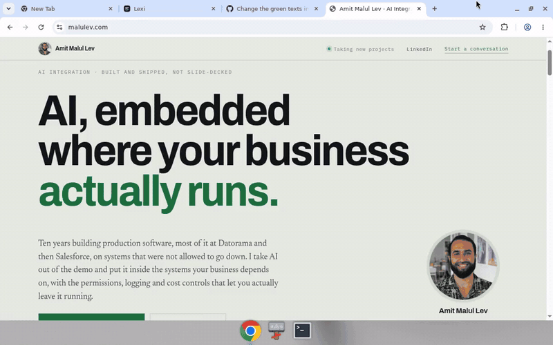
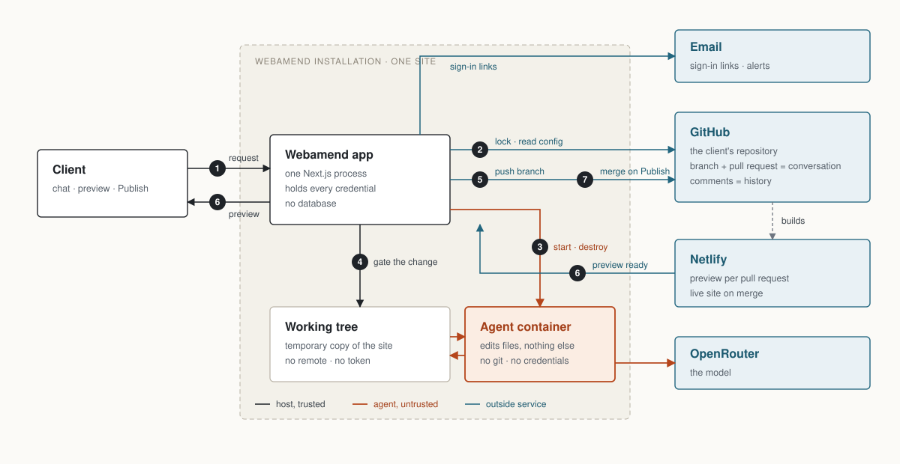

# Webamend

*Say what you want changed. See it before it goes live.*





In a hurry? [Quickstart](docs/QUICKSTART.md) has only the commands, and the
[new client checklist](docs/NEW-CLIENT.md) is the to-do list for onboarding a site.

A client describes a change to their website in plain language. An agent makes it on a branch, a
preview is built, and the client presses one button to publish. Nothing reaches the live site
without a person approving it.
**One installation serves one website.** No site selector, no tenant column — install it once per
client site, the way you would install a self-hosted CMS. There is no database: published state,
pending changes, conversation history and the audit trail live in GitHub and Netlify.

**How a request becomes a change**

1. **Ask.** The client types what they want changed, picks an effort tier, and may attach a file.
2. **Prepare.** The app takes a lock on the site (a git ref, so only one change runs at a time),
   reads `.webagent/config.yml` and `policy.yml`, and cuts a temporary working tree with no remote
   and no token.
3. **Edit.** A throwaway agent container edits that tree. It has no git, no credentials and no
   network path to the repository, so it cannot commit or push whatever the model decides.
4. **Gate.** The host reads what changed and checks it against the site's policy: allowed paths,
   size, hard-denied files. A refused change stops here as *blocked*.
5. **Push.** Only the permitted paths are committed and pushed to the conversation's branch. The
   pull request gets a comment that is both the client-facing reply and the durable record.
6. **Preview.** Netlify builds a Deploy Preview for the pull request. The app polls (or takes the
   webhook, whichever answers first) and streams the preview URL to the client's page.
7. **Publish.** The client presses one button. The pull request is merged, Netlify builds the live
   site, and *Undo* reverts that merge.

No database anywhere: a conversation is a pull request, a message is a comment, the lock is a git
ref, and the disk holds only a cache that rebuilds itself from a fresh clone.

---

## Who it's for

Webamend is installed by someone technical and used by someone who isn't. You keep the repository, the
policy and the deploy pipeline; the client gets a chat box and a publish button.

- **Freelance developers and agencies** handing off a site to a client who keeps asking for copy
  and image tweaks. The client stops queueing small changes behind your availability, and you stop
  billing hours against one-line edits — but every change still arrives as a reviewable pull
  request on a branch you control.
- **AI builders and vibe coders** who shipped a site fast and now need someone else to maintain it
  without touching the codebase or learning git.
- **Small teams without a CMS.** Marketing edits headlines, prices and images on a static site
  directly, with a preview before anything is live — no CMS to install, migrate or keep updated.

The client never sees a diff, a branch name or a build log. What bounds them is
`.webagent/policy.yml`: the paths the agent may touch, the size of a change it may make, and a
hard list of things it can never touch whatever that file says.

---

## Requirements

- **A GitHub repository linked to a Netlify site, with Deploy Previews enabled for pull
  requests** (Site configuration → Build & deploy → Deploy Previews). Without it the loop waits
  forever — the pull request opens and no preview is ever built, and nothing reports it as an
  error.
- **A GitHub App** installed on that one repository. Permissions: *Contents — read and write*,
  *Pull requests — read and write*, nothing else. Uncheck **Webhook → Active**. Generate a
  private key. You need the **App ID**, the `.pem`, and the **installation ID** (the number at the
  end of `github.com/settings/installations/<id>` after installing — not the App ID).
- **A Netlify personal access token and site ID.** Netlify tokens are account-wide with no
  per-site scoping, so the token reaches every site in its account. Put the site in its own
  Netlify team if that matters.
- **An OpenRouter API key**, with a spending limit set on it.
- **SMTP credentials** for sign-in emails and notifications.
- **Docker**, with Compose v2.17 or newer, and **Node 22+**.

---

## Run it locally

```bash
git clone <this repository>
cd website-ai-auto-builder
npm ci
docker build -t webagent/agent:latest agent/   # once, and again after any change under agent/
```

Every request starts a throwaway agent container on the local Docker daemon, so the agent image
must exist before the first request — in development too.

### Configure

```bash
cp .env.example .env
npm run gen:secrets >> .env
```

`gen:secrets` mints `SESSION_SECRET`, `NETLIFY_WEBHOOK_SECRET` and `TOTP_SECRET`. Use it rather
than writing these by hand: **a dotenv file expands `$NAME` references and quoting does not stop
it**, so a pasted value can arrive gutted. The generator escapes what it emits.

Signing in takes the email link and then a six-digit code from an authenticator app seeded with
`TOTP_SECRET`. Enrol yours with `npm run enroll:link`: open the URL it prints and scan the QR. The
link works for 24 hours and is the only page that ever shows the secret. Losing every enrolled
authenticator means minting a new secret and enrolling again.

Fill in the rest by hand: `GITHUB_APP_ID`, `GITHUB_APP_PRIVATE_KEY`, `GITHUB_INSTALLATION_ID`,
`GITHUB_REPO`, `NETLIFY_TOKEN`, `NETLIFY_SITE_ID`, `OPENROUTER_API_KEY`, `SMTP_URL`, `SMTP_FROM`,
`PUBLIC_BASE_URL`, and:

```bash
# Who may sign in. Deployment configuration, never repository configuration:
# write access to the client's repository must not confer access to the editor.
ALLOWED_EMAILS=jane@client.example,marketing@client.example
```

The private key can be pasted with literal `\n` or wrapped in double quotes across several lines;
both survive. Losing the `-----BEGIN`/`-----END` lines does not.

```bash
npm run check:env   # reports missing, malformed and empty variables. Prints no values.
```

### Start

```bash
export WEBAGENT_STATE_DIR="$PWD/.webagent-state"   # must be set
npm run dev
```

`http://localhost:3000`, with `PUBLIC_BASE_URL=http://localhost:3000` so sign-in links point back
at this machine. No public address is needed anywhere: the orchestrator polls Netlify, so the
whole request-to-preview loop completes with no tunnel and no webhook.

**`WEBAGENT_STATE_DIR` must be set.** It defaults to `/var/lib/webagent`, which is not writable on
a development machine, and the failure surfaces mid-request rather than at startup.

After an `npm ci`, a dependency bump or a branch switch, start with `npm run dev:clean` instead:
`.next` keys its chunk map to the dependency tree it was built against, and a stale one fails at
request time with `Cannot find module './vendor-chunks/<something>.js'`. Never share one `.next`
between `next build` and `next dev`.

Skip the email round-trip while testing:

```bash
npm run dev:session -- --out /tmp/jar.txt          # a signed cookie for the first ALLOWED_EMAILS address
curl -b /tmp/jar.txt localhost:3000/api/conversations
```

Startup validation **refuses to serve** on a bad setting rather than starting degraded — an
unreachable repository, an installation that does not answer, an unreachable Netlify site. A
`dev` that exits naming a variable has told you something true.

### Under Compose

```bash
docker compose up --build
```

Read the comment at the top of `docker-compose.yml` first: it mounts the Docker socket, which is
equivalent to root on the host. Here `WEBAGENT_STATE_DIR` has a second constraint — the path must
be **identical inside the container and on the host** (which is why it is bind-mounted to itself,
not a named volume). The host's daemon resolves that path on the host, so a named volume or two
different paths gives you an agent mounted on an empty directory.

### Checks

```bash
npm run lint && npm run typecheck && npm test && npm run test:int
```

| Command | What it does |
|---|---|
| `npm run check:env` | Reports missing, malformed or empty variables. Prints no values. |
| `npm run dev:clean` | Discards `.next` and starts the dev server. Use it after any dependency change. |
| `npm run gen:secrets` | Mints session secret, webhook secret, authenticator secret. |
| `npm run enroll:link` | Prints a 24-hour link that shows the authenticator QR. Send it to each client once. |
| `npm run dev:session -- --out <path>` | Writes a curl cookie jar holding a valid session. |
| `npm test` / `npm run test:int` | Unit tests; route handlers and startup validation against fakes. |
| `npm run test:e2e` | Live suite — real repository, real model, real build minutes. Skips loudly unless `WEBAGENT_E2E=1`. |

---

## What to add to the client's repository

Three files, and nothing else. No dependency to install, no build step to change, no code in the
site to modify:

```
the-client-site/
├── .webagent/
│   ├── config.yml     required — the installation refuses to run without it
│   └── policy.yml     required — without it the agent may touch every file (`allow: ['**']`)
└── AGENTS.md          optional — advisory guidance, at the repository root
```

Everything else the installation needs is outside the repository: the GitHub App installed on it,
Deploy Previews enabled on the Netlify site, and the secrets in the deployment's `.env`.

Operational settings live in the repository; secrets live in the environment. Nothing crosses that
line — a secret committed to the site's repository is rejected rather than honoured, and so is any
attempt to grant sign-in access from there.

### `.webagent/config.yml` — required

```yaml
alertContact: dev@agency.example              # where configuration faults and run alerts go
costCeilingUsd: 2.00                          # per request; the run stops rather than exceeds it
model: openrouter/anthropic/claude-sonnet-5   # runs when a request names no tier
maxRequestMinutes: 10                         # wall clock for one run

# Optional. Clients pick an effort tier in the composer, not a model; each tier
# has a built-in model, and any of them can be re-pointed here.
models:
  free: openrouter/cohere/north-mini-code:free
  low: openrouter/deepseek/deepseek-v4-flash-0731
  medium: openrouter/anthropic/claude-sonnet-5
  high: openrouter/anthropic/claude-opus-5
  extra: openrouter/anthropic/claude-fable-5.1

# Optional. Where files a client attaches land in the site.
uploadDir: public/uploads
```

| Key | Required | Shape |
|---|---|---|
| `alertContact` | yes | a valid email address |
| `costCeilingUsd` | yes | number greater than 0 |
| `model` | yes | `provider/model`, e.g. `openrouter/anthropic/claude-sonnet-5` |
| `maxRequestMinutes` | yes | whole number, 1–30 |
| `models` | no | any of `free`, `low`, `medium`, `high`, `extra`, each `provider/model` |
| `uploadDir` | no | relative path inside the repository. Default `public/uploads` |

The file is strict. An unknown key fails loudly rather than being ignored — `medum:` is a typo, not
a sixth tier. `allowedEmails` is rejected by name, with a message pointing at `ALLOWED_EMAILS` in
the deployment. So is any key that reads like a credential (`*secret*`, `*token*`, `*password*`,
`*api_key*`, `*private_key*`, `*credential*`): committing one is a misunderstanding of where
secrets live, not a typo, and the file is refused rather than honoured.

When this file is invalid the **last valid settings stay in force**, the fault goes to
`alertContact`, and the log names it. Access control never falls open on a broken file.

### `.webagent/policy.yml` — required

Write one before the first request. The installation still starts without it, but a missing file
means the defaults, and the default `allow` is `['**']`: every file in the site is fair game.

```yaml
allow:
  - 'src/components/**'
  - 'src/content/**'
  - 'public/images/**'
deny:
  - 'src/lib/payments/**'
maxFilesChanged: 15
maxDiffLines: 800
forbidNewDependencies: true
forbidExternalCode: true
```

| Key | Default | What it bounds |
|---|---|---|
| `allow` | `['**']` | globs the change may touch. Everything else is refused |
| `deny` | `[]` | globs refused inside `allow`, for carving holes in a broad allow |
| `maxFilesChanged` | `15` | files in one change set |
| `maxDiffLines` | `800` | added plus removed lines |
| `forbidNewDependencies` | `true` | refuses anything under a vendor directory (`node_modules/**`) |
| `forbidExternalCode` | `true` | refuses *added* markup that loads or runs code from another origin |

Unknown keys fail loudly here too.

**Whatever `allow` says**, the gate always refuses these — a site's own rules cannot widen what
governs it:

`.webagent/**` · `**/AGENTS.md` · `**/CLAUDE.md` · `**/.opencode/**` · `**/.env*` · `.github/**` ·
`netlify.toml` · `netlify/**` · `.netlify/**` · `**/_redirects` · `**/_headers` · `vercel.json` ·
`api/**` · `functions/**` · `wrangler.toml` · `**/*.config.{js,cjs,mjs,ts,mts,cts}` ·
`**/tsconfig*.json` · `**/.babelrc*` · `**/.npmrc` · `**/.yarnrc*` · `**/.husky/**` ·
`**/Dockerfile*` · `**/docker-compose*` · `**/Makefile` · `**/*.sh` · `.gitmodules` ·
`.gitattributes` · `**/.git/**` · every dependency manifest and lockfile at any depth
(`package.json`, `package-lock.json`, `yarn.lock`, `pnpm-lock.yaml`, `bun.lockb`, `Gemfile*`,
`requirements.txt`, `pyproject.toml`, `poetry.lock`, `go.mod`, `go.sum`, `Cargo.*`, `composer.*`).

A symbolic link in a change set is refused outright, whatever it points at.

**Sizing the allow list is the part people get wrong.** Every file a normal request must touch has
to be in `allow`, including the ones that are easy to forget:

- `sitemap.xml`, `robots.txt`, `llms.txt` — a new page that is not in the sitemap is a new page
  Google finds late. None of these are unconditionally denied; they are simply not allowed unless
  you allow them.
- the stylesheet, if new sections are meant to extend it.
- **every page that repeats the header and footer.** On a static site with no templating, adding
  one page to the navigation edits every other page — seven pages plus the new one plus the sitemap
  is nine files, which the default `maxFilesChanged: 15` covers and a tightened `5` does not. Count
  it before you tighten it.

`forbidExternalCode` reads *added* text in files a browser renders as markup (`.html`, `.svg`,
`.md`, `.jsx`, `.vue`, `.astro`, …) and refuses an off-site `<script src>`, any `<iframe>`,
`<object>`, `<embed>` or `<portal>`, a `<base>` tag, a `meta refresh`, and `javascript:` URLs.
Inline scripts and same-origin `src` are left alone. Existing tags are not this change's doing —
only added ones count, **which includes a new page that copies an existing analytics snippet
verbatim**. If your pages carry a third-party tag in their `<head>`, either move it behind a
same-origin loader script or expect every new page to be refused.

### `AGENTS.md` — the site's own instructions

Optional, at the repository root, plain Markdown. It is prepended to every agent prompt as
advisory guidance. It never widens what the policy permits, and the agent may not edit it —
`AGENTS.md` and `CLAUDE.md` are denied at any depth, because an agent able to write its own future
instructions is shaping the next run.

It is the difference between an agent that adds a page and an agent that adds a page the way this
site adds pages. Cover: the stack and where files live; the site map and URL shape; the components
and classes that already exist (and the instruction not to invent more); the SEO invariants —
canonical, title and description limits, one `<h1>`, structured data, sitemap; how images are
prepared; language and direction; the facts it may state and the facts it must never invent; the
files it must not touch; and the checks to run before reporting done.

**A worked example is in [`docs/AGENTS.example.md`](docs/AGENTS.example.md)** — a hand-written
static site on Netlify, with a step-by-step "how to add a new page" covering header, footer,
`<head>`, JSON-LD, breadcrumbs, sitemap and images.

### What never goes in the repository

Sign-in addresses (`ALLOWED_EMAILS`) and every credential. They are deployment configuration:
write access to the site's repository must not be able to grant access to the editing interface.

There is no configuration page. The configuration in force is the repository's `.webagent/` files
and the deployment's `.env`, both versioned or backed up and neither editable from the web. Changing
a setting means committing to the client's repository — so an operational change is a reviewable,
versioned edit with an author, not an unattributed mutation in a web form.

---

## Host it on a VPS

One box serves many clients, but **not by sharing anything**. Each client gets its own Linux user
running its own rootless Docker daemon, its own `/srv/webamend/<slug>` at mode 0700, and its own
Compose project. That per-user daemon is the whole boundary: the socket the app mounts is root on
whoever owns it, so a compromise reaches one unprivileged client user rather than the host. (A
socket proxy is not an alternative — it filters paths, not request bodies, and the runner needs
`POST /containers/create`, whose body carries the bind mounts.)

Sizing: ~400 MB of RAM per running agent (measured) plus ~160 MB per idle installation. Each
client runs at most one agent at a time, and today nothing admits across clients, so budget for
every client running one at once: 4 GB carries four or five clients, 16 GB carries 20–25. The
host-wide queue that lifts that constraint is designed in
`docs/superpowers/specs/2026-09-14-host-admission-queue-design.md`. Allow ~10 GB of disk per
client, plus ~1.2 GB of images per client — each rootless daemon keeps its own image store.

### Once per host

```bash
apt-get update && apt-get install -y git curl caddy
git clone <this repository> /opt/webamend/src && cd /opt/webamend/src
ops/bootstrap-host.sh            # Docker, rootless prerequisites, /srv/webamend, local registry
ufw allow 22,80,443/tcp && ufw --force enable
```

### Once per client

```bash
ops/provision-client.sh acme edit.acme.example 3001   # user, rootless daemon, 0700 tree, .env skeleton
sudoedit /srv/webamend/acme/.env                          # GitHub App, Netlify, OpenRouter, SMTP, ALLOWED_EMAILS
```

`provision-client.sh` prints the remaining steps verbatim, including how to run `gen:secrets` and
`check:env` in a throwaway container so the host needs no Node toolchain.

Point the hostname at the box before the next step: an **A record** for `edit.acme.example` to
the VPS's public IP, plus an AAAA record if it has IPv6. Caddy obtains its certificate on the first
request, and it cannot until the name resolves. Set `PUBLIC_BASE_URL=https://edit.acme.example` in
the client's `.env` so sign-in links point there too.

```bash
ops/release.sh --client acme     # build once, deliver, start, wait for it to answer
cat >>/etc/caddy/Caddyfile <<'CADDY'
edit.acme.example {
    reverse_proxy 127.0.0.1:3001
}
CADDY
systemctl reload caddy
ops/status.sh                    # daemon, container, HTTP, running agents, deployed tag
```

### Releasing new code

```bash
cd /opt/webamend/src && git pull && ops/release.sh
```

Both images are built **once** on the host's root daemon, tagged with the git short SHA, and
delivered to each client's daemon — twenty installations do not each run `npm ci && npm run build`.
Clients roll one at a time and a failure on one is stepped over rather than aborting the rest.
Restarting mid-request is safe: the request is reconstructed from its pull request and its lock is
broken as stale.

`ops/README.md` is the operator's reference.

### Four things not to get wrong

- **`/srv/webamend/<slug>` and its `state/` stay 0700.** They are the containment. Each per-request
  working tree is made writable by the agent container's foreign uid, which is safe precisely
  because nothing outside that installation can traverse the directory holding it.
- **Each client runs one agent at a time; the host runs up to one per client.** The site lock
  bounds an installation, and nothing bounds the host across installations yet, so the client
  count is the host's agent ceiling. `ops/status.sh` reports it as `webamend_clients_total`.
- **Set `PORT_HOST`, never `PORT`.** `.env` is both interpolated by Compose and passed into the
  container, where Next reads `PORT` as its listen port. Give each client a distinct `PORT_HOST`,
  bound to loopback, behind the reverse proxy.
- **Never run `docker compose build` in a client directory.** A client directory holds a compose
  file, a `.env` and state — no source. Releases build in `/opt/webamend/src` via `ops/release.sh`.

### What to back up

Each client's `.env`. That is the whole list: the authenticator secret is in it. The state
directory is a cache that rebuilds itself from a fresh clone, and everything else lives in GitHub
and Netlify.

### The Netlify webhook is optional

Netlify → Site configuration → Notifications → outgoing webhook for **deploy started**,
**succeeded** and **failed**, pointing at `$PUBLIC_BASE_URL/api/webhooks/netlify`, signed with
`NETLIFY_WEBHOOK_SECRET`. Set it up if the installation has a public address; skip it if it does
not. The orchestrator also polls, so the webhook only makes the preview appear a few seconds
sooner.

---

## Naming

The product's name, tagline and mark live in `src/lib/brand.ts` and `src/components/Brand.tsx`;
every client surface reads them from there, so renaming is a one-file change.

## What it will not do

Deferred by explicit decision, not oversight: visual element picking, self-serve onboarding,
multi-model routing, billing, and any application database.

See `.specify/memory/constitution.md` for the principles this is held to, and
`specs/001-conversational-site-editing/` for the specification, plan and contracts.

## License

Copyright (C) 2026 Amit Malul Lev. Licensed under the **GNU Affero General Public License v3.0 or
later** — the full text is in [`LICENSE`](LICENSE).

Use it, change it, run it for your clients. The one obligation that matters here is section 13: if
you offer a modified version to anyone over a network — which is the normal way to run this — you
must offer those users its source. Running it unmodified, or modifying it privately without
offering it to anyone, obliges you to nothing.
